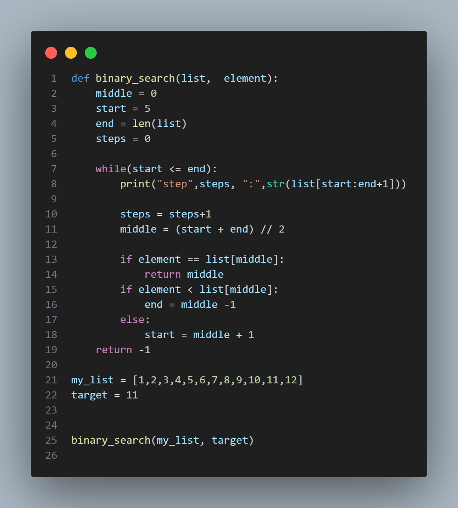

# Binary-search-algorithm

A binary search algorithm is something a user can use to search for a number. Example: If i have a list of 1 - 10, and i am looking for the number 5,the binary-search-algorithm(BSA) will add the number, 1 and 10(0 and 9 in the way of a list) and divide it by two until it finds the number

    There are a few steps in making this:

1. Use a def() function with a variable(binary_search), then put two variables in bracket(def binary_search(list, element)). Then make four variables in different lines, then put a number after them, but in a particular variable put the len of the variable -> list(middle = 0.  start = 5.  end = len(list). steps = 0)
2. Make a while loop then put the variable(start) to be <= the variable(end)
3. Put the variable(steps) to be = the variable steps+1. Then put the variable(middle) = (start + end) // 2
4. Make an if statement of the variable(element) to be == list[middle], then return the value(middle)
5. Make another if statement of the variable(element) to be < list[middle]. Then put the variable(end) in another line to be = middle -1
6. Make an else statement, the put the variable start to be = middle + 1. Then return -1(but it shouldn't be under the else statement, or the while loop,it should be under the def function)
7. Make a variable(my_list) to be equal to a list of numbers. Then make another variable(target) to be equal to the number you are looking for
8. Then print out all the code(binary_search(my_list, target))

    If you don't understand you can look at the image below:
